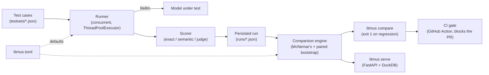

# Litmus


**A real test, not a vibe check.**

Litmus is an LLM evaluation and regression-testing tool. Given a prompt + model
config and a golden test set, it detects when a prompt or model change causes a
statistically significant regression, tracking accuracy, cost, and latency over
time, not just "did the output change."

## Why

Most "LLM eval" projects are a script that diffs two outputs and eyeballs whether
it looks worse. Real AI teams need to know, with statistical confidence, whether
a prompt tweak or model swap actually degraded quality, and by how much it moved
cost/latency, ideally as a CI gate before it ships, not after a user complains.

## Quickstart

```bash
uv sync

# put a real provider key in .env (litellm/python-dotenv pick it up automatically)
echo 'GEMINI_API_KEY=...' >> .env

# run the same test set against two prompt/model configs
uv run litmus run testsets/example --model gemini/gemini-2.5-flash-lite --prompt-version v1
uv run litmus run testsets/example --model gemini/gemini-2.5-flash-lite --prompt-version v2

# compare two persisted runs (exits 1 if a regression is statistically significant)
uv run litmus compare <baseline_run_id> <candidate_run_id>

# local dashboard (JSON API) at http://127.0.0.1:8000
uv run litmus serve
```

## Features at a glance

| | |
|---|---|
| **Real statistics, not deltas** | McNemar's test (exact binomial below a small discordant-pair count, chi-square above it) for pass/fail rate; a paired bootstrap CI for latency, cost, and mean score |
| **Pluggable scoring** | exact/schema match, semantic similarity (embeddings), and LLM-as-judge, whose judge returns a continuous 0.0-1.0 confidence score, not a bare boolean |
| **Catches quiet drift** | `mean_score` flags a model getting less confident/similar before enough cases flip to move the pass rate |
| **Knows its own limits** | `power_warning` flags comparisons with too few cases or too few discordant pairs to trust the statistics |
| **CI-native** | a GitHub Action that runs the suite on a PR and fails the job, posting the reasoning, if a regression is real |
| **Fast** | test cases run concurrently by default (`ThreadPoolExecutor`) |
| **One config file** | every threshold/default lives in `litmus.toml`, resolved as CLI flag > config file > hardcoded fallback |
| **Zero infrastructure** | JSON per run, queried via DuckDB (no database server), git-diffable, works identically locally or in CI |
| **Structured logs** | every run/comparison/API request logged as JSON Lines, independent of console output |
| **Transparent by design** | mismatched or errored test cases between two runs are excluded from stats but always surfaced, never silently dropped |

## How it works



- **Test case store**: a versioned golden dataset (input, expected output/rubric,
  tags) as JSON files under `testsets/`, diffable in git.
- **Runner**: executes each test case against a target (prompt version + model),
  concurrently by default.
- **Scorer**: pluggable per test case, exact/schema match, semantic similarity,
  or LLM-as-judge with a real confidence score.
- **Comparison engine**: aligns a baseline and a candidate run by test case,
  then applies the statistical test that fits the data, a metric is only
  flagged when it moves in the *worse* direction and the difference is real.
- **CI gate**: runs the same comparison on a PR and fails the check on a
  real regression.
- **Dashboard**: a JSON API for the latest comparison, historical trends, and
  per-case drill-down.

## Examples

### Catching a real regression

A support-ticket triage classifier: the baseline prompt gives explicit urgency
criteria, the candidate asks the model to "use your judgement" instead, a
plausible real-world prompt edit.

```
$ uv run litmus run testsets/routing_baseline --model gemini/gemini-2.5-flash-lite --prompt-version baseline
[PASS] t01: 'urgent' (412.3ms, $0.000011)
[PASS] t02: 'routine' (389.7ms, $0.000011)
...
Saved run cd06b0e6c44d4db0a3584e8e608a2777 to runs

$ uv run litmus run testsets/routing_candidate --model gemini/gemini-2.5-flash-lite --prompt-version candidate
[PASS] t01: 'urgent' (398.1ms, $0.000011)
[FAIL] t02: 'urgent' (401.2ms, $0.000011)
...
Saved run d8d16e16c5e442859ad1a13111c93ec0 to runs

$ uv run litmus compare cd06b0e6c44d4db0a3584e8e608a2777 d8d16e16c5e442859ad1a13111c93ec0
[REGRESSION] pass_rate: baseline=0.9643 candidate=0.5000 delta=-0.4643 p=0.0008741
[ok] latency_ms: baseline=398.0661 candidate=373.5803 delta=-24.4858 95% CI=[-63.61, 11.93]
[ok] cost_usd: baseline=0.0000 candidate=0.0000 delta=-0.0000 95% CI=[-3.6e-06, -3.6e-06]
Result: REGRESSION DETECTED
```

Pass rate dropped from 96.4% to 50.0%, a 46-point swing. Latency and cost moved
too, but stayed unflagged: only a metric moving in the *worse* direction counts
as a regression, and the candidate was actually a little faster and cheaper here.

### Flagging a test set that's too small to trust

The same 28-ticket comparison above, checked against a higher case-count bar:

```
$ uv run litmus compare cd06b0e6c44d4db0a3584e8e608a2777 d8d16e16c5e442859ad1a13111c93ec0 --min-case-count 30
NOTE: low statistical power - only 28 common test case(s) (wanted at least 30).
[REGRESSION] pass_rate: baseline=0.9643 candidate=0.5000 delta=-0.4643 p=0.0008741
...
```

The comparison still runs, the regression is still real, but Litmus tells you
up front when a test set is thin enough that a smaller effect could have gone
undetected, rather than presenting every result with the same confidence.

## Configuration

Every scattered default lives in one place: `litmus.toml` at the project root,
not a `[tool.litmus]` section in `pyproject.toml`, since the system under test
doesn't have to be a Python project itself for Litmus's own config to apply.
Precedence is **CLI flag > `litmus.toml` > hardcoded fallback**:

```toml
# litmus.toml
alpha = 0.01
min_case_count = 20

[scorers.llm_judge]
threshold = 0.7
```

## CLI reference

`litmus run <testset_dir> --model <name>` also accepts `--max-workers`
(default `4`) for concurrent LLM calls.

`litmus compare <baseline_run_id> <candidate_run_id>` accepts:

- `--alpha` (default `0.05`): significance level for McNemar's test
- `--confidence` (default `0.95`): confidence level for the bootstrap CIs
- `--min-case-count` / `--min-discordant-pairs` (both default `10`):
  `power_warning` thresholds
- `--exact-threshold` (default `25`): below this many discordant pairs,
  `pass_rate` uses the exact binomial test instead of the chi-square
  approximation
- `--n-resamples` (default `10000`): bootstrap resample count

All of the above are overridable project-wide via `litmus.toml` instead of
passing flags every time.

## CI gate setup

`.github/workflows/eval-gate.yml` runs on any PR touching `testsets/**` or
`src/litmus/**`. It requires one repository secret, `GEMINI_API_KEY`, used
by `litellm` to call a model when running the eval suite against the PR
branch (swap the `--model` value and secret name for a different provider).

It finds the most recent persisted run committed to `runs/` on the base
branch, runs the test set fresh against the PR branch, compares the two,
posts the result as a PR comment, and fails the job on a real regression.

## Stack

Python, FastAPI (dashboard), Pydantic (schemas), `litellm` (multi-provider
calls and embeddings), `scipy.stats` (significance testing), JSON + DuckDB
(no database server), packaged as a pip-installable CLI.
