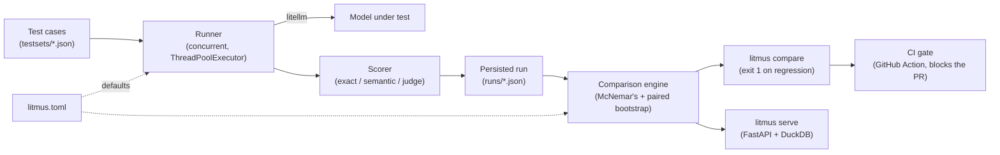

# Litmus


**A real test, not a vibe check.**

Litmus is an LLM evaluation and regression-testing tool. Given a prompt + model
config and a golden test set, it detects when a prompt or model change causes a
statistically significant regression, tracking accuracy, cost, and latency over
time, not just "did the output change."

## Why

Most "LLM eval" projects are a script that diffs two outputs and eyeballs whether
it looks worse. Real AI teams need to know, with statistical confidence, whether
a prompt tweak or model swap actually degraded quality, and by how much it moved
cost/latency, ideally as a CI gate before it ships, not after a user complains.

## Quickstart

```bash
uv sync

# put a real provider key in .env (litellm/python-dotenv pick it up automatically)
echo 'GEMINI_API_KEY=...' >> .env

# run the same test set against two prompt/model configs
uv run litmus run testsets/example --model gemini/gemini-2.5-flash-lite --prompt-version v1
uv run litmus run testsets/example --model gemini/gemini-2.5-flash-lite --prompt-version v2

# compare two persisted runs (exits 1 if a regression is statistically significant)
uv run litmus compare <baseline_run_id> <candidate_run_id>

# local dashboard (JSON API) at http://127.0.0.1:8000
uv run litmus serve
```

## Features at a glance

| | |
|---|---|
| **Real statistics, not deltas** | McNemar's test (exact binomial below a small discordant-pair count, chi-square above it) for pass/fail rate; a paired bootstrap CI for latency, cost, and mean score |
| **Pluggable scoring** | exact/schema match, semantic similarity (embeddings), and LLM-as-judge, whose judge returns a continuous 0.0-1.0 confidence score, not a bare boolean |
| **Catches quiet drift** | `mean_score` flags a model getting less confident/similar before enough cases flip to move the pass rate |
| **Knows its own limits** | `power_warning` flags comparisons with too few cases or too few discordant pairs to trust the statistics |
| **CI-native** | a GitHub Action that runs the suite on a PR and fails the job, posting the reasoning, if a regression is real |
| **Fast** | test cases run concurrently (`ThreadPoolExecutor`, default 4 workers): a measured ~4.25x speedup over sequential on a 24-case set |
| **One config file** | every threshold/default lives in `litmus.toml`, resolved as CLI flag > config file > hardcoded fallback |
| **Zero infrastructure** | JSON per run, queried via DuckDB (no database server), git-diffable, works identically locally or in CI |
| **Structured logs** | every run/comparison/API request logged as JSON Lines, independent of console output |
| **Transparent by design** | mismatched or errored test cases between two runs are excluded from stats but always surfaced, never silently dropped |

## Architecture



- **Test case store**: versioned golden dataset (input, expected output/rubric,
  tags), as JSON/YAML files under `testsets/`, so test sets are diffable in git.
- **Runner**: executes each test case against a target (prompt version + model),
  capturing output, token cost, and latency. Runs concurrently by default
  (`max_workers=4`, configurable) since real network calls dominate latency;
  cases are fully independent, so this is a pure speedup, not a behavior change.
- **Scorer**: pluggable strategies per test case, either exact/schema match,
  semantic similarity (embeddings, cosine similarity thresholded into pass/fail),
  or LLM-as-judge against a rubric (the judge returns a continuous confidence
  score 0.0-1.0, also thresholded, not just a bare boolean verdict).
  Pluggability is the differentiator over a naive string-diff eval.
- **Comparison engine**: given a baseline run and a candidate run, computes
  four per-metric deltas with real significance testing. McNemar's test handles
  pass/fail rates (exact binomial test below a small discordant-pair count,
  chi-square approximation above it, with `pass_rate.method` reporting which one
  ran), and a paired bootstrap CI handles latency, cost, and mean score (all
  paired, same-test-case-before/after data, not independent samples), rather
  than eyeballing percentages. `mean_score` catches a model quietly getting less
  confident/similar before enough cases flip to move the pass rate. A
  `power_warning` flags when there are too few test cases or too few discordant
  pairs for the statistics to be trustworthy. All of `alpha`, `confidence`,
  `min_case_count`, `min_discordant_pairs`, `exact_threshold`, and `n_resamples`
  are configurable via `litmus compare` options or `litmus.toml`.
- **History store**: every run persisted with timestamp + prompt/model version,
  so trendlines are possible, not just single comparisons.
- **CI gate**: a GitHub Action that runs the suite on a PR touching prompts/model
  config and fails/comments if a regression is statistically significant.
- **Dashboard**: minimal UI for the latest comparison, historical trends, and
  drill-down into failing cases.
- **Structured logging**: every run, comparison, and API request is logged as
  JSON Lines to `logs/litmus.jsonl` (rotating, gitignored), independent of the
  console output, see Observability below.

## Configuration

Every scattered default lives in one place: `litmus.toml` at the project root,
not a `[tool.litmus]` section in `pyproject.toml`, since the system under test
doesn't have to be a Python project itself for Litmus's own config to apply.
Fully commented-out by default; uncomment and adjust what you want to override.
Precedence is **CLI flag > `litmus.toml` > hardcoded fallback**:

```toml
# litmus.toml
alpha = 0.01
min_case_count = 20
max_workers = 8

[scorers.llm_judge]
threshold = 0.7
```

## Stack

- Python, FastAPI for the dashboard
- Pydantic for test-case/result schemas
- `litellm` for multi-provider support and embeddings
- `scipy.stats` for significance testing
- JSON per run as the source of truth, queried via DuckDB (no database server)
- Packaged as a pip-installable CLI (`litmus run`, `litmus compare`)

## Observability

Every `litmus run`/`litmus compare` invocation and every `litmus serve` API
request is logged as structured JSON Lines to `logs/litmus.jsonl` (one JSON
object per line, rotating at 5MB/3 backups), in addition to the normal
console output:

```text
{"timestamp": "2026-07-20T17:27:46.47Z", "level": "INFO", "logger": "litmus",
 "message": "run started", "event": "run_started", "testset_dir": "testsets/example",
 "model": "gemini/gemini-2.5-flash-lite", "prompt_version": "v1", "case_count": 2}
```

Configurable via `--log-file`/`--log-level` (or `LITMUS_LOG_FILE`/
`LITMUS_LOG_LEVEL`, or `litmus.toml`); defaults to `logs/litmus.jsonl` at `INFO`.

## Case study: catching a real prompt regression

**Domain:** a support-ticket triage classifier that labels each incoming ticket
`urgent` or `routine`. Real product routing prompts look exactly like this:
narrow, binary, and easy to get subtly wrong when someone "simplifies" the
prompt.

**The prompts.** Baseline gives the model explicit, narrow criteria for what
counts as urgent (complete outage, permanent data loss, security breach,
payment/billing failure, explicit cancellation threat). The candidate is a
plausible real-world edit: someone replaces the explicit criteria with "use
your judgement," which is shorter, reads fine in a PR diff, and is exactly the
kind of change that ships without anyone noticing a problem:

```text
# baseline
Mark it urgent if it involves: a complete service outage, permanent data
loss, a security vulnerability/breach, a payment or billing failure, or an
explicit threat to cancel the account. Otherwise mark it routine.

# candidate
Classify the ticket as "urgent" or "routine" based on how important or
serious it seems.
```

**Test set:** 28 real support tickets (`testsets/routing_baseline/`,
`testsets/routing_candidate/`, same 28 tickets, same expected labels, each
wrapped in one of the two prompts above), run for real against
`gemini/gemini-2.5-flash-lite` via `litellm`. Total cost for both runs: under
$0.001.

**Real captured output** (`uv run litmus compare <baseline_run_id>
<candidate_run_id>`, exit code 1):

```text
[REGRESSION] pass_rate: baseline=0.9643 candidate=0.5000 delta=-0.4643 p=0.0008741
[ok] latency_ms: baseline=398.0661 candidate=373.5803 delta=-24.4858 95% CI=[-63.61, 11.93]
[ok] cost_usd: baseline=0.0000 candidate=0.0000 delta=-0.0000 95% CI=[-3.6e-06, -3.6e-06]
Result: REGRESSION DETECTED
```

Pass rate dropped from **96.4% to 50.0%** (a 46-point swing), with
**p = 0.00087** on the hand-rolled McNemar's test (paired pass/fail
comparison), nowhere near noise. Latency and cost use a paired bootstrap CI
for the mean difference rather than a p-value, since they're paired
(same-test-case, before/after) continuous data. Latency's 95% CI straddles
zero (no real effect), and cost's CI sits entirely below zero (a real
decrease) but correctly **isn't** flagged as a regression: a cheaper
candidate isn't a problem, `compare_runs()` only flags a metric moving in the
*worse* direction, not just "changed."

What actually broke: every ticket that didn't literally match one of the five
explicit criteria (a webhook silently failing for two days, a partner
integration out of sync for 48 hours, a slow-loading app for some users) got
waved through as `routine` by the baseline prompt, exactly as specified.
Under "how important it seems," the model started calling almost all of
them `urgent`. The regression is real, it's exactly the kind of drift a
manual before/after glance would likely miss (both prompts *look*
reasonable), and it's caught with a real p-value instead of a gut feeling.

**Dashboard**, hit against the same two runs (`uv run litmus serve`, JSON
API; there's no rendered frontend yet, see Architecture):

```text
GET /compare/cd06b0e6c44d4db0a3584e8e608a2777/d8d16e16c5e442859ad1a13111c93ec0
{"baseline_run_id":"cd06b0e6c44d4db0a3584e8e608a2777","candidate_run_id":"d8d16e16c5e442859ad1a13111c93ec0",
 "pass_rate":{"metric":"pass_rate","baseline_mean":0.9643,"candidate_mean":0.5,"delta":-0.4643,
   "flagged":true,"p_value":0.000874,"ci_low":null,"ci_high":null},
 "latency_ms":{"metric":"latency_ms",...,"flagged":false,"p_value":null,"ci_low":-64.94,"ci_high":10.32},
 "cost_usd":{"metric":"cost_usd",...,"flagged":false,"p_value":null,"ci_low":-3.6e-6,"ci_high":-3.6e-6},
 "any_flagged":true,"common_case_count":28,
 "baseline_only_ids":[],"candidate_only_ids":[],"errored_ids":[]}

GET /trends
[{"run_id":"cd06...","prompt_version":"baseline","pass_rate":0.9643,...},
 {"run_id":"d8d1...","prompt_version":"candidate","pass_rate":0.5,...}]
```

`common_case_count`/`baseline_only_ids`/`candidate_only_ids`/`errored_ids` make
a narrowed comparison visible rather than silent: if a testset changes
between runs, or a case errors out, the comparison still runs on whatever's
left in common, but the report says so explicitly instead of quietly
shrinking the sample.

## Milestones

1. ✅ Test-case schema + runner producing raw results for one prompt/model
2. ✅ Scoring engine with 3 pluggable strategies (exact/schema match, semantic
   similarity, LLM-as-judge)
3. ✅ Comparison engine: baseline vs. candidate with real stats, not just deltas
4. ✅ Persistence + trend view across versions
5. ✅ GitHub Action CI gate (PR fails/comments on regression), built and
   locally validated, not yet exercised against a live PR
6. ✅ Dashboard (JSON API: comparison, trends, per-run drill-down)
7. ✅ README case study: a real caught regression with a real p-value (above)
8. ✅ Concurrent test execution + a single consolidated config file (`litmus.toml`)

## CLI reference (comparison thresholds)

`litmus compare <baseline_run_id> <candidate_run_id>` accepts:

- `--alpha` (default `0.05`): significance level for McNemar's test
- `--confidence` (default `0.95`): confidence level for the bootstrap CIs
- `--min-case-count` / `--min-discordant-pairs` (both default `10`):
  `power_warning` thresholds
- `--exact-threshold` (default `25`): below this many discordant pairs,
  `pass_rate` uses the exact binomial test instead of the chi-square
  approximation
- `--n-resamples` (default `10000`): bootstrap resample count

`litmus run <testset_dir> --model <name>` also accepts `--max-workers`
(default `4`) for concurrent LLM calls. All of the above are overridable
project-wide via `litmus.toml` instead of passing flags every time.

## CI gate setup

`.github/workflows/eval-gate.yml` runs on any PR touching `testsets/**` or
`src/litmus/**`. It requires one repository secret:

- `GEMINI_API_KEY`: used by `litellm` to actually call a model when running
  the eval suite against the PR branch. (Swap the workflow's `--model` value
  and secret name if you're targeting a different provider.)

The workflow finds the most recent persisted run committed to `runs/` on the
base branch, runs the test set fresh against the PR branch, compares the two
via `litmus compare`, posts the result as a PR comment, and fails the job if
a statistically significant regression is flagged. If the base branch has no
persisted runs yet, the gate is skipped (nothing to compare against).

## Status

125 tests passing (all offline/mocked except the real Gemini calls behind the
case study above): schema, loader, runner (concurrent by default), real
`litellm` execution, the `litmus run`/`litmus compare`/`litmus serve` CLI,
all three scorers (including the judge's continuous confidence score), four
comparison metrics (`pass_rate`, `latency_ms`, `cost_usd`, `mean_score`) with
real significance testing and a `power_warning` for low-data comparisons,
DuckDB-backed trend queries, the CI gate workflow (built and locally
validated, not yet exercised against a live PR), the FastAPI dashboard,
structured JSON-lines logging, a single consolidated config file
(`litmus.toml`), and the case study above. A single test case's LLM/scoring
failure is isolated (recorded as `[ERROR]`, doesn't lose the rest of the
batch); mismatched or errored test cases between two runs being compared are
excluded from the statistics but always surfaced explicitly, never silently
dropped.

This project has been through seven rounds of adversarial code review, each
finding and fixing real, distinct issues (a CI gate that never actually
fired, a live smoke test catching a bug no mocked test could, a statistically
misapplied significance test, and more). See `CLAUDE.md` for the full
decision log.

Not yet built: a rendered frontend for the dashboard (it's a JSON API today),
a hosted/deployed version, and a license file. All deliberate, not
oversights; see `CLAUDE.md`.
